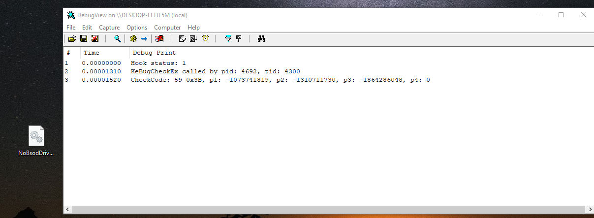

# NoBsod
Remove BSOD from your system

### How it works
Exportable KeBugCheckEx function calls when an error occurred in kernel mode. We can simply hook this function and sleep thread for infinity time

### Pictures

### References
[kCaveHook](https://github.com/Umbre11as/kCaveHook)

[Zydis](https://github.com/zyantific/zydis)
